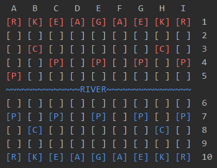

# Chinese Chess
A Python based functional game for two players. Similar to chess, goal is to win by checkmate. Game will only allow legal moves to be passed and will prevent player from putting their General in check. Game will automatically change state from “unfinished” to declaring a winner once a player has no legal moves that would not result in check.

 Please read the "Board", "Rules", and "Pieces" sections on [the Wikipedia page](https://en.wikipedia.org/wiki/Xiangqi).
 
 Locations on the board will be specified using "algebraic notation", with columns labeled a-i and rows labeled 1-10, with row 1 being the Red side and row 10 the Black side.
 
 
Here's a simple example of how the to operate the game and use additonal features:
```
game = XiangqiGame()
game.make_move('a4', 'a5')
game.make_move('a7', 'a6')
game.make_move('a5', 'a6')
game.make_move('a10', 'a6')
game.make_move('h3', 'h10')

state = black_in_check = game.is_in_check('black')
print (state)
state = game.get_game_state()
print (state)
```

Current state of the board will print after each move. This screenshot shows the state of the board after the opening move of e4 to e5:



